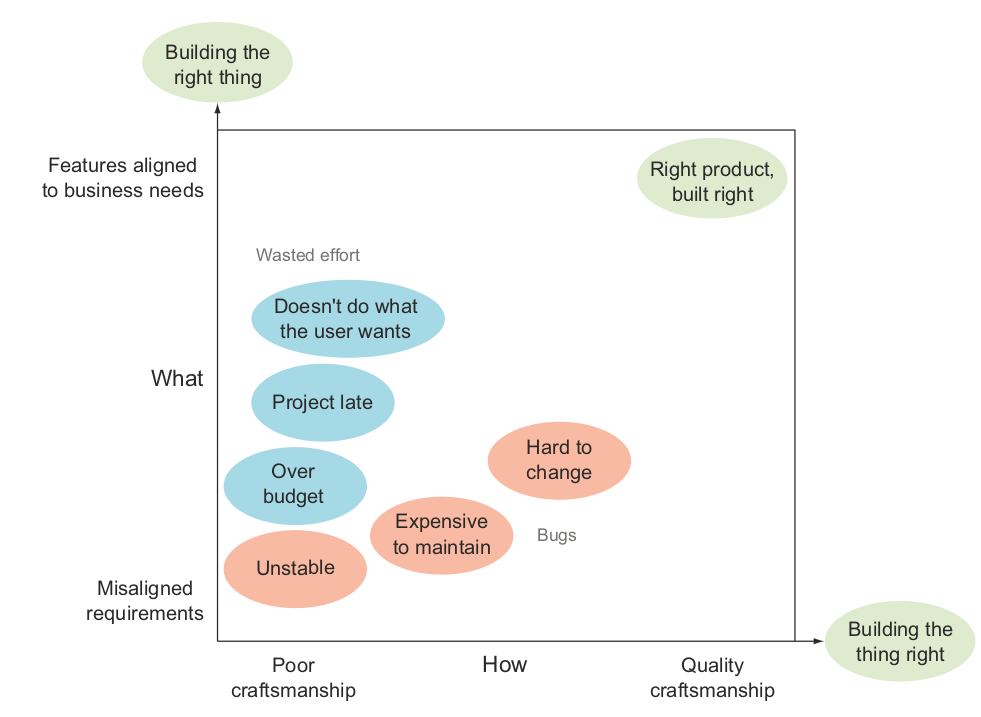
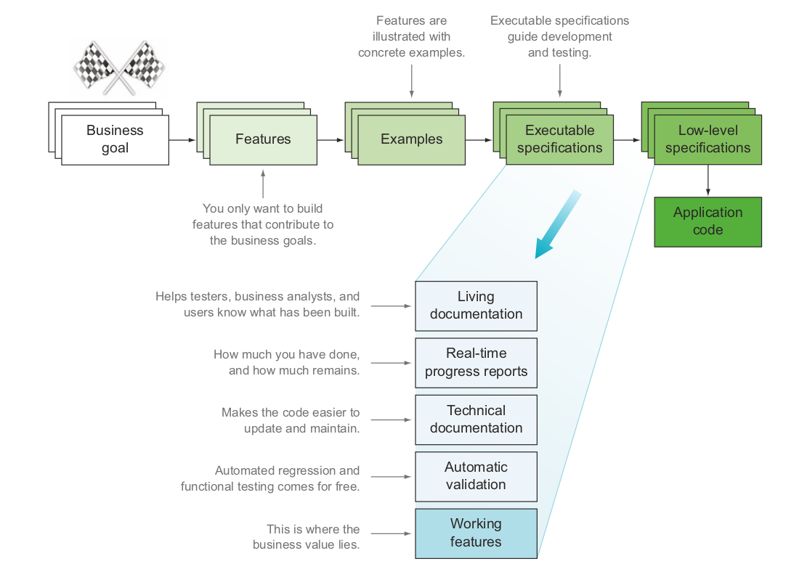

*Note: This is a WIP*

No, that's not all true. I should have said, I've read the chapter one of the book. And, it's that chapter that we'll try to discuss in detail.

## Book overview
*BDD in action* is a book by John F Smart, an international speaker & consultant well known in the Agile community. The book teaches the Behavior-Driven Development (BDD) model and shows how to integrate it into an existing development process.

The book comprises twelve chapters divided into four parts. It is intended to a broad audience like business analysts, developers, project managers...

The end goal of the book is build and deliver better software, i.e. software that works well and is easy to change, maintain, and provides real value to its users.

### Why BDD?
There're two signicant reasons for why we need BDD. First, around half of all software projects fail to deliver in some significant way. The second reason is that billions of dollars wasted

So we need a way that would let us discover and focus our efforts on what really matters.

Enters the BDD...

... which is not a method but a number of methods and techniques used by teams to build and deliver more valuable, more effective, and more reliable software.

Now that we have a basic overview of the book, let's consider the first chapiter an a little more detail.

## Building software that makes a difference
This first chapter discusses four main topics:
- problems solved by BDD
- origins and principals of BDD
- activities and outcomes in a BDD project
- pros and cons

### Problems
Studies show that around half of all software, projects fail to deliver in some significant way. In general, there are two main categories of problems that BDD tries to solve:

- Not building the software right (quality issue): poor design, bad code, no automated test...
- Not building the right software: no real value to the users

### Origins and principals
Dan Noth invented BB in the early to mid-2000s  as an easier way
to teach and practice Test-Driven Development (which was invented by Kent Beck in the early days of Agile).

TDD is just good, but many teams still have difficulty adopting and using it effectively. North observed that a few simple practices, such as naming unit tests as full sentences and using the word “should,” can help developers write more meaningful tests, which in turn helps them write higher-quality code more efficiently. Given the impact of his approach, North started referring to what he was doing no longer as Test-Driven Development, but as *Behavior*-Driven Development.

DBB principles are as follows (8):

- focus on features that deliver business values: deliver more useful features earlier and with less wasted effort
- work together to specify features:
- embrace uncertainty
- illustrate features with concrete examples
- don’t write automated tests, write executable specifications (it uses the natural language for everyone to understand)
- don’t write unit tests, write low-level spec
- deliver living doc
- use living doc to support ongoing maintenance work
### Activities and outcomes in a BDD project

### Pros and cons
see p29

