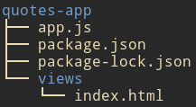

If you're building apps with Nodejs and feel like you need a tool to help you enhance the UI, this article is for you. It will guide you step by step on how you can add `Bootstrap` to your `Nodejs`.

Let's create a simple app that contains the text `Hello the World` in a Bootstrap `jumbotron`.

## The Initial Project

Create a simple Node project like the one below.



Nothing tricky here. Create a folder for your project and initialize it as Node project, `npm init -y`. Create the server file, `app.js` (`touch app.js`), and other directories (`mkdir views`).

Let's install `express` to configure a lightweight Node server.

`npm i express` or `yarn add express`.

We can now create our basic server.

```js
const express = require("express")
const path = require("path")

const app = express()

app.get("/", (req, res) => {
  res.sendFile(path.join(__dirname, "views/index.html"))
})

app.listen(5000, () => {
  console.log("Listening on port " + 5000)
})
```

We are listening on port `5000` and serving up `index.html` file. Make sure you have it created already and add some `html` contents in it.

Start your server (`node app.js`) and see if everything is OK. If so, let's move to the next session.

## Adding Bootstrap CSS

The first solution I'd suggest here is to use a CDN. Here's how you can do it.

Go [here](https://getbootstrap.com/docs/4.5/getting-started/introduction/#quick-start) to copy Bootstrap CSS and eventually additional JS and paste them in your index file.

### Using a CDN

Now is the time to modify our `index.html` so that we can add Bootstrap CSS.

```html
<!DOCTYPE html>
<html lang="en">
  <head>
    <!-- Required meta tags -->
    <meta charset="utf-8" />
    <meta
      name="viewport"
      content="width=device-width, initial-scale=1, shrink-to-fit=no"
    />

    <!-- Bootstrap CSS -->
    <link
      rel="stylesheet"
      href="https://stackpath.bootstrapcdn.com/bootstrap/4.5.0/css/bootstrap.min.css"
      integrity="sha384-9aIt2nRpC12Uk9gS9baDl411NQApFmC26EwAOH8WgZl5MYYxFfc+NcPb1dKGj7Sk"
      crossorigin="anonymous"
    />

    <title>Hello, the world!</title>
  </head>
  <body>
    <div class="jumbotron">
      <div class="container"><h1>Hello, the world!</h1></div>
    </div>

    <!-- Optional JavaScript -->
    <!-- jQuery first, then Popper.js, then Bootstrap JS -->
    <script
      src="https://code.jquery.com/jquery-3.5.1.slim.min.js"
      integrity="sha384-DfXdz2htPH0lsSSs5nCTpuj/zy4C+OGpamoFVy38MVBnE+IbbVYUew+OrCXaRkfj"
      crossorigin="anonymous"
    ></script>
    <script
      src="https://cdn.jsdelivr.net/npm/popper.js@1.16.0/dist/umd/popper.min.js"
      integrity="sha384-Q6E9RHvbIyZFJoft+2mJbHaEWldlvI9IOYy5n3zV9zzTtmI3UksdQRVvoxMfooAo"
      crossorigin="anonymous"
    ></script>
    <script
      src="https://stackpath.bootstrapcdn.com/bootstrap/4.5.0/js/bootstrap.min.js"
      integrity="sha384-OgVRvuATP1z7JjHLkuOU7Xw704+h835Lr+6QL9UvYjZE3Ipu6Tp75j7Bh/kR0JKI"
      crossorigin="anonymous"
    ></script>
  </body>
</html>
```

I added two Bootstrap classes: `container` and `jumbotron`.

Restart your server and go check if `Bootstrap` is on the page (just see if a fluid jumbotron is there).

This solution is good, but when working offline, you'll be limited. That's why I want you to test the next solution.

### Using `npm`

The first thing you have to do hear is to install packages, which are `bootstrap` and optionally `jquery`.

`npm i bootstrap jquery --save`

To make use of these files we have to modify our `app.js` so that it will serve them to us.

```js
// app.js
const express = require("express")
const path = require("path")

const app = express()

app.use(
  "/css",
  express.static(path.join(_dirname, "node_modules/bootstrap/dist/css"))
)
app.use(
  "/js",
  express.static(path.join(_dirname, "node_modules/bootstrap/dist/js"))
)
app.use("/js", express.static(path.join(_dirname, "node_modules/jquery/dist")))

app.get("/", (req, res) => {
  res.sendFile(path.join(__dirname, "views/index.html"))
})

app.listen(5000, () => {
  console.log("Listening on port " + 5000)
})
```

Thanks to `express.static()` we are able to serve up `Bootstrap` without any difficulty.

Now we can make use of `Bootstrap` in our `HTML` pages by just linking to it as `<link rel="stylesheet" href="./css/bootstrap.min.css">`.

## Conclusion

In this article, we learned how to integrate `Bootstrap` in our `Nodejs` project in two different ways. The first way is to use official `CDN` and the last one to use `npm`. This last solution is suitable if you're working locally (and offline).

Do you have another you to work with Bootstrap in a Node project? Share with us!
