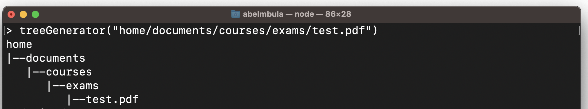

Do you know the Linux command that generates a tree of directories and files? In Bash, we use `tree` command. If you’re just learning programming, it can be an excellent exercise to code a program like this.

For the sake of simplicity and learning, we’ll be doing something very basic and simple. Here’s the scenario:

- given a path like this `home/documents/courses/exames/test.pdf`
- print the tree like this

```bash
home
|--documents
   |--courses
      |--exams
         |--test.pdf
```

Before moving forward, let’s pause a bit and think about the algorithm.

## Think algorithmically

The first step in problem-solving is the problem statement (description) that we already have in the introduction. Now is the time to analyze the problem.

1. the path is divided in lines following the separator `/`
2. the characters `|--` are added before the word from the second line
3. the tree is indented by 3 characters every time starting from the 3rd line

With all these, we can develop a high-level algorithm (a kind of very basic [pseudo-code](/blog/pseudocode)).

Let’s name our program `treeGenerator()`. It should do the following:

```bash
devide the path
print each word in the path line by line
add |-- before the word from the 2nd word
indent by 3 every time from the 3rd word
```

Now that we have our algorithm, let’s move on to implementing the program.

## Code implementation

Before we start our implementation, let me remind you of something more important. I think you even guess it already, don’t you? It's about the good programmer workflow.

> **The good programmer workflow**
>
> - a good programmer doesn't write a program all at once
> - a good programmer writes and test the program in a series of builds. Each build adds to the previous one
>
> In short, a good programmer works incrementally, add small pieces one at a time and constantly re-checking the work so far.

To help with the builds, we can use the high-level algorithm.

### First build

Nothing special here. We create our function that has one parameter and uses the high-level algorithm in the form of comments.

```jsx
function treeGenerator(path) {
  // -- Split the path --
  // -- Print array items line by line
}
```

Everything seems ok for the first build, let’s move on to the second one.

### Second build

This build will add the logic to split the path. We won’t be writing much code here, because JS has a built-in method for that. Let’s just use the `split()`method.

```js
function treeGenerator(path) {
  // -- Split the path --
  const dir = path.split("/") // <-- new code

  // -- Print array items line by line
}
```

The `split()` method takes a separator (`/` in our case), divides a string (`path` parameter here) into substrings thanks to the separator, puts the substrings into an array, and returns that array. So, as you can notice, the variable `dir` is an array that contains each word in the `path`.

Now is the time to print array items.

### Third build

This last build will focus on the logic of printing each array item line by line. Here are the recommended steps to follow:

- print the first item in the array
- print the second item preceded by `|--` characters
- print the following items preceded by `|--` and indented by multiple of 3

The first 2 steps are just simple. From the third item, we’ll need to iterate through the array and follow the logic below for each line:

- indent every time by a multiple of 3
- add the characters `|--`
- add the item of the nth position

Let’s now write the code for everything above.

```js
function treeGenerator(path) {
  // -- Split the path --
  const dir = path.split("/")

  // -- Print array items line by line
  // 1st line
  console.log(dir[0]) // <-- new code

  // 2nd line
  console.log("|--" + dir[1]) // <-- new code

  // Next lines
  let indent = 0 // <-- new code
  for (let i = 2; i < dir.length; i += 1) {
    // <-- new code
    indent += 3
    console.log(" ".repeat(indent) + "|--" + dir[i])
  }
}
```

To repeat a character `n` times, we use the `repeat()` method.

Our program is ready to test, given that we have covered everything we wanted it to do. But, remember, we are not common developers, but good ones. As such, we swear only by elegance and clean code.

Let’s refactor our `treeGenerator()`function.

```js
function treeGenerator(path) {
  // -- variables declaration --
  const CONNECTOR = "|--"
  const SPACE_PREFIX = " "
  const dir = path.split("/")
  let indent = 0

  // -- Print the 1st two items
  console.log(dir[0])
  console.log(CONNECTOR + dir[1])

  // Iterate from the third item
  for (let i = 2; i < dir.length; i += 1) {
    indent += 3
    console.log(SPACE_PREFIX.repeat(indent) + CONNECTOR + dir[i])
  }
}
```

We put a little order in the code. Notice how I use capital letters for the first two variables, which are real “constants”. But you can feel free to use small caps.

## Test the program

To test the function, I use Node.js REPL on Mac.

Example 1 :

`path=home/documents/courses/test.pdf`



Example 2:

`path=Users/abelmbula/codes/kadea.academy/src/utils/faq.ts`


## Conclusion

Congratulations! You’ve reached the end of this tutorial. We learned how to code a basic tree generator like the `tree` command we can find on Linux. Throughout this tutorial, you learned, among other things, how to:

- think algorithmically like a (great) programmer
- convert a string into an array thanks to `split` method
- repeat a string n times thanks to `repeat` method

## Next steps

Up to this point, you’ve built a basic tree generator tool. This s a good starting point for you to continue adding features and learning in the process. This will help you take your skills with JavaScript to the next level.

Should you miss ideas to improve your application, here are a few of them you can implement to continue improving your tree generator tool:

- add a feature to generate tree per directory level (see image below)
- make your app a true CLI app with Node.js

These are just a few ideas of how you can continue adding features to your tree generator app. Take the challenge and build something amazing on top of this!


