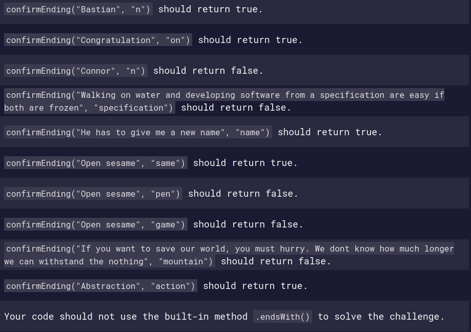

Today, I spent a little time working on this FreeCodeCamp algorithm challenge. So, I decided to share my solution with you in case you might need or be stuck somewhere in your resolution.

Let's go!

## The Challenge Description

Here is what they ask us to do:

> Check if a string (first argument, `str`) ends with the given target string (second argument, target).
> This challenge can be solved with the `.endsWith()` method, which was introduced in ES2015. But for the purpose of this challenge, we would like you to use one of the JavaScript substring methods instead.

```js
function confirmEnding(str, target) {
  return str
}

confirmEnding("Bastian", "n")
```

## Tests Cases

They've provided us with tests cases that our code must run again. If we pass all the cases it means that our program works well.



Let's try to analyse the challenge.

## Understanding the Challenge

### Requirements

Reading through out the description, we quickly understand that our function has `two` parametors and should return a `boolean` (`true` or `false`) as output.

One another thing I notice is that they warn us not use the builtin method `.endsWith()`.

For us to pass the challenge, we must not use `.endsWith()` method. But at the end of our resolution, I'll provide you with this altenative solution.

### Thinking

A part from the requirements above, here's how I think we can handle the challenge in big picture.

Capture the last `n` charactors to the length of `target` and compare those `n` charactors with `target`, if they're the same we return `true` if not we return `else`.

Before capturing the last `n` charactors we have to delete any spaces between words so that we will be just cheking with one word (string).

Let's illustrate my word with an example. Given this string `I am a test` with this target `st`.

Following my logical thiking as stated above, here's how you'll do:

1. delete all spaces, so string becomes `Iamatest`
2. the legnth of target is `2`
3. the last two charactors are `st` (`n` charactors)
4. comparison `st` == `st`
5. output `true`

Do you get it? Let's try to implement, first in pseudocode then in JavaScript.

## Implementation

I suggest that we start with `pseudocode` implementation before jumping to real code with `JavaScript`.

If you don't know what's `pseudocode`, read [here](/pseudocode/).

### Pseudocode

```
confirmEnding(str, target)
Set newStr to str without spaces
Set subStr to last n charactors of newStr (n = target length)
Set status to true

IF subStr is different to target
  reset status to false
ENDIF

RETURN status
```

Now let's tap onto the next big section related to the real world implementation in JavaScript.

### JavaScript Code

In this section, I wan to translate our pseudocode to real code.

Let's analyze every step in the pseudocode above.

Just a reminder in case you might have forgotten, the provided code looks like this:

```js
function confirmEnding(str, target) {
  return str
}

confirmEnding("Bastian", "n")
```

Our function requires 2 parametors, `str` and `target`

**1. Set newStr to str without spaces**

We need to initialize a variable called `newStr` (call it any name you want, it does not matter) and set its value to our `str` parametor but by deleting all available spaces.

You have many ways to do that. You can use a regular express (regex) or `split` plus `join()` methods.

Using regex the code will look like this `str.replace(/\s/g, '')`. This code can be interpreted as: replace all whitespace charactors (`\s`) in `str` by `''` (no space).

If we want to use the second method, we will do like this:

- `str.split(' ')` to create an array containing each word in `str`. Note that we use whitespace charactor `' '` as separator
- `str.split(' ').join('')` to convert the array into a string that has no whitespace

Let's put all this in our real code

```js
function confirmEnding(str, target) {
  // with regex
  const newStr1 = str.replace(/\s/g, "")
  console.log(newStr1) // Iamatest

  // with split + join
  const strArr = str.split(" ")
  console.log(strArr) // ["I", "am", "a", "test"]
  const newStr2 = strArr.join("")
  console.log(newStr2) // Iamatest

  // in 1 line const newStr2 = str.split(' ').join('');
  return str
}

confirmEnding("I am a test", "st")
```

Deleting all unnecessary stuffs, the function looks like:

```js
function confirmEnding(str, target) {
  // with regex
  const newStr1 = str.replace(/\s/g, "")

  // with split + join
  const newStr2 = str.split(" ").join("")

  return str
}

confirmEnding("I am a test", "st")
```

In the next lines, I'll stick on `const newStr = str.split(' ').join('');`. Feel free to chose your prefered one.

**2. Set subStr to last n charactors of newStr**

We know that `n = target length`, so `n = 2`. The last 2 charactors of `newStr` are `st`.

So, how do we get substring from a string? We can simple use `substring()` method. It requires at least one parametor, the index of the first character to include in the returned substring.

To get that index, I think we can take the length of `newStr` to which we substract the length of `target`. So, `targetIndex = newStr.length - target.length`. `newStr.length = 8`, `target.length = 2`. Now `targetIndex = 8 - 2 = 6`.

Remember that 6 of `targetIndex` is the 6th index not the 6th charactor. The 6th index is the 7th charactor, `s` in our example (`Iamatest`).

Let's put all this in our code

```js
function confirmEnding(str, target) {
  // previous code here...
  const strL = newStr.length
  const targetL = target.length
  const targetIdx = strL - targetL
  const subStr = newStr.substring(targetIdx)
  console.log(subStr) // st

  return str
}

confirmEnding("I am a test", "st")
```

**3. Set status to true**

```js
function confirmEnding(str, target) {
  // previous code here...
  const status = true

  return str
}
```

**4. Reset status to false**

```js
function confirmEnding(str, target) {
  // all other code here...
  if (subStr != target) {
    status = false
  }

  return str
}
```

**5. Return status**

```js
function confirmEnding(str, target) {
  // all other code here...

  return status
}
```

Putting all togather, we have this

```js
function confirmEnding(str, target) {
  const newStr = str.split(" ").join("")
  const strL = newStr.length
  const targetL = target.length
  const targetIdx = strL - targetL
  const subStr = newStr.substring(targetIdx)
  const status = true

  if (subStr != target) {
    status = false
  }

  return status
}

confirmEnding("I am a test", "st")
```

Let's do a little improvement (the current code is functionally OK, you can stick on it) just for the purpose of elegance.

```js
function confirmEnding(str, target) {
  const newStr = str.split(" ").join("")
  const strL = newStr.length
  const targetL = target.length
  const targetIdx = strL - targetL
  const subStr = newStr.substring(targetIdx)

  return subStr == target
}

confirmEnding("I am a test", "st")
```

I delete the `status` variable and return `subStr == target`. This also return `true` if the two value are the same and false in other case.

Running the test, we get 100% as you can see in the printSc below


Congratulations on your pass.

Let's see an alternative solution using `.endsWith()`

## Alternative Solution using .endsWith()

Note that if you going through freecodecamp, you must not use this solution.

```js
function confirmEnding(str, target) {
  return str.endsWith(target)
}
```

The method returns `true` if the string ends with the target charactors and `false` if not.

## Resources and links

1. [Confirm the Ending](https://www.studytonight.com/data-structures/bubble-sort), the algorithm challenge on freecodecamp.org
2. [split() method](https://developer.mozilla.org/en-US/docs/Web/JavaScript/Reference/Global_Objects/String/split), MDN web docs
3. [join() method](https://developer.mozilla.org/en-US/docs/Web/JavaScript/Reference/Global_Objects/TypedArray/join), MDN web docs
4. [substring() method](https://developer.mozilla.org/en-US/docs/Web/JavaScript/Reference/Global_Objects/String/substring), MDN web docs
