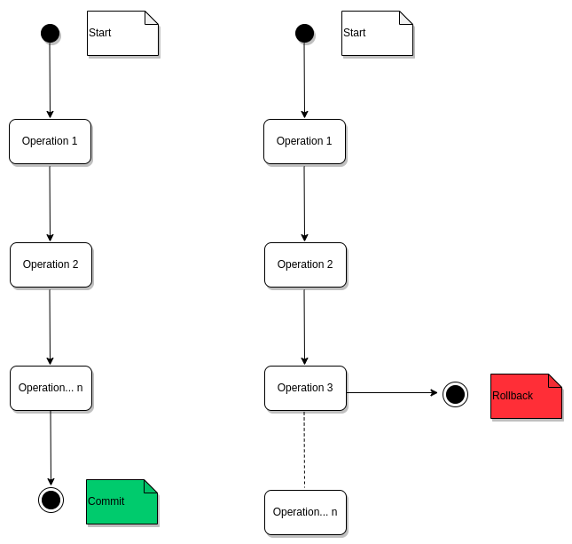
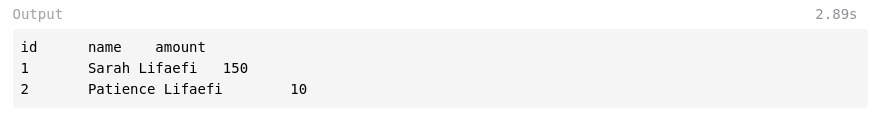
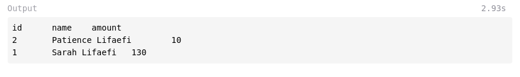
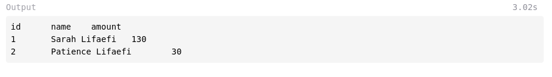

Simply speaking, a transaction or a unit of work is a set of database operations that we want to treat as  "a whole". It has to either happen completely or not at all.



To ensure the correctness of a transaction, a database must be atomic, consistent, isolated, and durable. These four properties are commonly known under the acronym ACID.

## The transaction properties

You have already guesed it, there are four properties:

**Property #1: Atomicity**

More often, but not always, a transaction is made of multiple SQL statements. The atomic property states that all the statements must either be complete entirely or have no effect whatsoever. No partial execution should be permitted. The idea is that a transaction must always leave the database in a consistent state. This leads us to the second property.

**Property #2: Consistency**

From the previous explanation, we understand that the transaction must only bring the database from one valid state to another. This property ensures that there are no database constraint violations.

**Property #3: Isolation**

The isolation property guarantees that the uncommitted state changes are not visible or do not affect other concurrent transactions.

**Property #4: Durability**

This property states that a committed transaction must permanently change the state of the database, even in case of a system failure like a power outage or crash. This implies that a successful transaction must always be recorded in non-volatile memory and/or a persisted transaction log.

## Transaction in action

Untill now we have discussed the database transaction in theory. Let's it in practice. We'll be considering bank transfers scenario.

Let's say we have two clients in our database, Sarah and Patience. The first one wants to transfer an amount of 20 dollars to the second client. Here's the process so far:

1. Decrease Sarah's total amount by 20 dollars
2. Increase Patience's total amount by 20 dollars

But the problem is that both of these two operations must be fully completed (commit) or not at all (rollback).

Before we continue, do create a table, **users** for instance, with **id**, **name** and **amount** fields. You can enter these data:

| id | name                 | amount|
| -- | -------------------- | ----- |
| 1  | Sarah Lifaefi Masika | 150   |
| 2  | Patience Lifaefi     | 10    |

To make sure everything is OK, run the command below:

```sql
SELECT * FROM client;
```
You should have this output:



Great! We're now ready to proceed with the decrease and increase operations. 

**Decrease operation**

```sql
UPDATE client
SET amount = amount - 20
WHERE id = 1;
```
We decrease $20 from the total amount of the user with **id** 1, that's Sarah.

Run the `SELECT` command again and you should get this output:



The total amount for Sarah is now $130.

**Increase operation**

```sql
UPDATE client
SET amount = amount + 20
WHERE id = 2;
```
The code snippet above adds $20 to the amount of Patience, so that it is now $30.

Did you noticed that we ran two separate operations? That's not a transaction at all. Remember we said above that a transaction is a set of database operations that we want to treat as  "a whole". So, if we really wants to run both operations in ONE operation, aka transaction, here's the code:

```sql
BEGIN TRANSACTION; -- <-- transaction begins here

-- decrease first
UPDATE client
SET amount = amount - 20
WHERE id = 1;

-- than increase
UPDATE client
SET amount = amount + 20
WHERE id = 2;

COMMIT TRANSACTION; -- <-- transaction ends here
```
That's all for the transaction. Now if we run the `SELECT` command, here's what we get:

