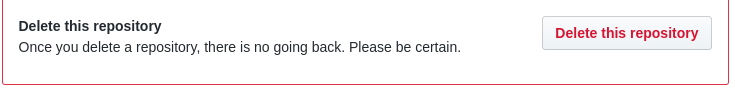

When learning Git and GitHub, you create so many repos just for a test. Once you master the skill, you no longer need those repos. So, how do you delete them? This post is there to answer to your question.

Let's go step by step!

1. Login to [Github](https://github.com/)
2. Open the repo you want to delete
3. Click Setting tab (the last on the right)
4. Scroll down till the `Danger zone` (you have read well, Danger zone)
5. Click `Delete this repository` (once done, you cannot revert the operation, so think twice before hitting thr button)

If you are in doubt, you can `hide` or `archive` it.

That is it, a simple how to in 5 steps.
