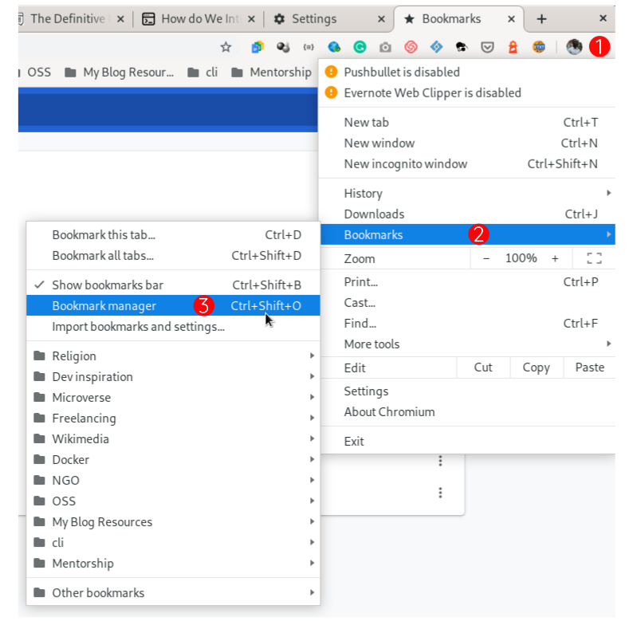
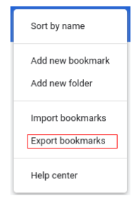
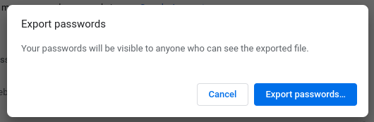
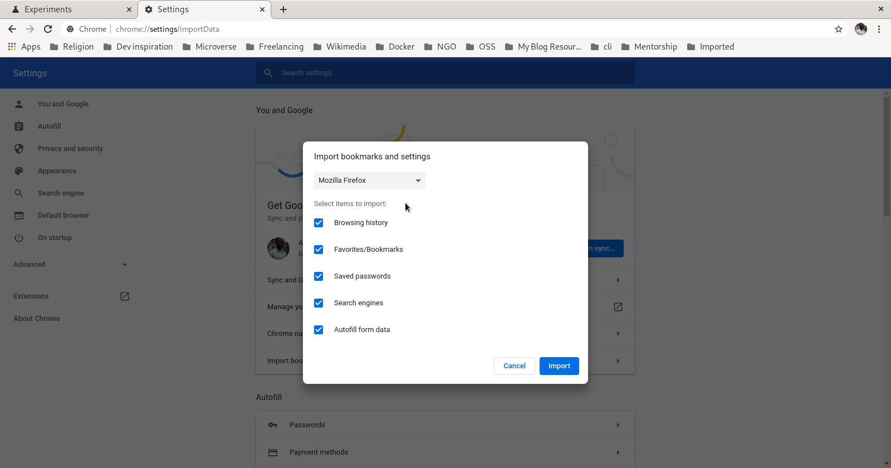

Today, I want to share with you some tips I use to have my browser data when I switch to a new computer.

A little bit about my browsers use: I was using Firefox and Chromium for a longtime. I have abandoned firefox to only use chromium. In a recent computer I only use Chromium. But, I want to give chrome a try. I am not at all comfortable with the browsers `sync` functionality.

The experience I'm about to share with you here conceerns taking all my data from my `Chromium` to my newly installed `Chrome`.

First, what is Chrome and what is Chromium? If you wondering about it, read the next section. If not, jump it.

## Chrome or chromium?
Simply speaking, they are two different browsers. `Chrome`, or `Google Chrome`, is a `propriatary software` by Google built based on `Chromium` which is a free and open-source project from Google too. Chrome has more features than Chromium. Chromium is also the source base for some other browsers such as `Microsoft Edge`, `Opera`, and `Amazon Silk`. 

After this simple refresher, let's now start by exporting data.

## Exporting Data
The first thing to do is to take data from our old browser (`Chromium` in our case). 

There are many data that the browser may keep for us:
* Bookmarks,
* Passwords,
* Cookies,
* History,
* etc.
But in this article, I am going to focus on the first two (bookmarks and passwords).

### Exporting Bookmarks
Open your browser (Chromium), got to the menu button (top right) --> Bookmarks --> Bookmarks manager (`Ctrl + Shift + O`).

In the Bookmarks Manager, click the three dots on the top right and `Export bookmarks` in the location of your choice (make sure you don't forget it as you'll need it in order to import)

### Exporting Passwords
Menu --> Settings. Click on `Passwords` and on the three dots (next to Saved Passwords). Export your password from there.

Be aware that your passwords will be visible to anyone who can see the exported files (so keep it in a safe place)

With all our needed data exported, we can now go to an other computer or browser (Chrome here) to use them.

## Importing Data

### Bookmarks
In the new browser, go to menu --> Bookmarks --> Import bookmarks and settings...

Chose your exported file and go!

### Passwords
There something to do here before importing because this option is not yet activated by default in the browser.

Enter this `chrome://flags/` in the `address bar`. Seach for `Password import` and enable it (click `Enabled`).

Now you can go to Password (`chrome://settings/passwords`), click the three dots and import.

You can enjoy browsing with your new Browser as I did.

## Closing Notes

If you want to use a new computer or browser, you don't have to worry about your browser data (bookmarks, passwords...). The only thing you have to do is to export your them from the old browser and then import them in the new browser.

Make sure you keep your exported data in a safe place. I'd suggest to to delete after use.

And you, how do you do? Share with us!
