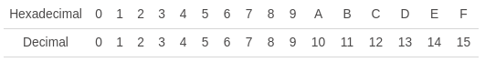

With just a little knowledge of HTML, CSS, and JavaScript (JS) you can create something realy great. This tutorial aims to showcase how you can combine your knowledge of these three language and build a functional app. The app you'll build at the end of this lesson takes a hex (short for hexadecimal) color (e.g.: **#457a7a**) as input and returns an rgb equivalent as output (**rgb(69,122,122)**). As a bonus the will change the background of the right bloc of the page into the submitted color as well as the color of the rgb text. You can see the finished app [here](https://codepen.io/bam92/full/QWwOMYR).

We will be building our app in two parts. This is the first part and it is focusing on HTML and CSS.

## The Basic Formula

It all starts with the HTML.

```html
<form>
    <label for="hex-code">#</label>
    <input type="text" placeholder="Enter hex code without #" name="hex-code" id="hex-code">
    <input type="submit" value="Convert">
</form>
<div>
    <p>RGB color is <span id="rgb"></span></p>
</div>
```

We create a simple form with an input where user can enter the hex code, and a submit button to start conversion. A hex color always starts with **#**, so no need to enter it, and has 6 symboles in the range [0-9a-f].

The output will be printed in the ```span``` element above after the user has submitted the form.

Let add some JS code to get the user input:

```javascript
const formElt = document.querySelector('form');
const hexColor = document.querySelector('input[type="text"]').value ;

formElt.addEventListener('submit', event => {

  console.log('You entered: ', hexColor)

  event.preventDefault();

})
```

Nothing tricky here. We use ```querySelector()``` to select elements on the DOM. To get the value of the input use ```value``` property on the specified element (hexColor in our case). To handle form submission use ```submit``` event. To prevent the default behavior and avoid the form submit to reload the page we make use of ```event.preventDefault()```. 

Let make the magic happen:

## The Hex to RGB Conversion

Hex and RGB are both different ways of expressing the same thing: a red, green and blue color value. Hex colors are widelly used in Web while RGB are used in printing.

A hex (also called base 16)  consists of sixteen numbers and letters. 10 numbers in the range [0-9] and 6 letters [A - F]. These letters come after the decimals in ascending order (meaning that A = 10, B = 11, etc.). So, the hexadecimal series looks like this: 0, 1, 2, 3, 4, 5, 6, 7, 8, 9, A, B, C, D, E, F. 

.

A hex color starts with hash (#) and comprises 6 digits of which the first two represents red, the following two green and the last two is blue. You can see it in image below:

.

The rule to convert a hex to decimal is like this:
- Given a hex number **c97**
- start from the right and go to the left: **79c**
- multiply each digit by 16 to the power of **n** (n start by 0 and increase it by 1 everytime you go to the next number): 7 * (16 ^ 0), 9 *  (16 ^ 1), 12 *  (16 ^ 2)
- sum the result: 7 + 144 + 360 = 511

You may notice that in our example, c is converted to its decimal equivalent 12 (refer to the table of conversion above).

Assuming that you have understood the general rule of converion, let now apply it for colors conversion.

A hex color has 6 digits (3 digits code is also accepted, but we cannot take it in account for this program) of which each two digits represent RGB color. For instance **74b0af**: 74 represent red, b0 green, and af blue. To get their decimal value we do this:
- red: 4 * (16 ^ 0) + 7 * (16 ^ 1) = 116
- green: 0 * (16 ^ 0) + 11 * (16 ^ 1) = 176
- blue: 15 * (16 ^ 0) + 10 * (16 ^ 1) = 175

So, #74b0af = rgb(116, 176, 175). Very easy, no? That's plein English, let think of an algorithm to write it in JavaScript.

## The JavaScript Conversion Algorithm

Let understand the calculation: we only have two digits by color category (e.g.: 74 for red), so the power n will go from 0 to 1. (16 ^ 0) = 1, (16 ^ 1) = 16. Our calculation (for red color: 74) will be like this: 4 * 1 + 7 * 16 = 4 + 7 * 16 or 7 * 16 + 4. The general formula will be like this (without inverting the number):
**first digit * 16 + second digit**.

Let take again our example above 74b0af

- red: 7 * 16 + 4 = 116
- green: 11 * 16 + 0 = 176
- blue: 10 * 16 + 15 = 175


