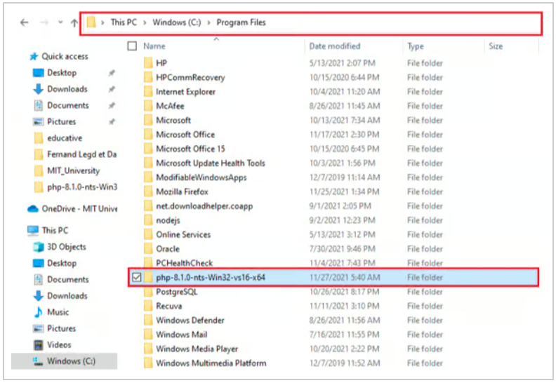
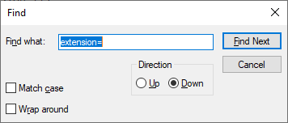
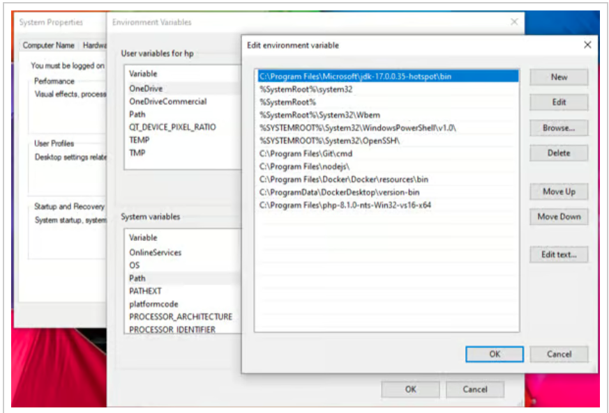
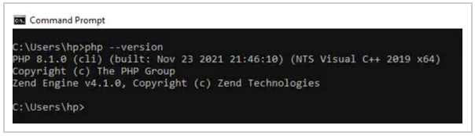

Imagine that you’ve just bought a new computer and want to quickly execute PHP commands. Although I work with Docker, I sometimes need to run some PHP commands or work with composer outside the containers. Therefore, it is always a good idea to have PHP installed on our machine.

If you have learned about LAMP stack, then you will know PHP is the last layer in this stack.

In this shot, we will go through the following three steps to install PHP 8 on windows:

* Step 1: Get the PHP files and extract them.
* Step 2: Configure the `php.ini`.
* Step 3: Add PHP to the path environment variable.

## Step 1: Get the PHP files and extract them

First thing first, you need to download PHP files. Go to this [site](https://windows.php.net/download), choose your PHP version (PHP 8 for us), and download the provided zip file.

Next, we will extract the zip file to `C:\Program Files`.



> **Note**: I’ve put my PHP files under `Program Files`, but feel free to put them anywhere you want. Some might prefer to store their files under `C:\`.

## Step 2: Configure the `php.ini`

`php.ini` is the PHP configuration file. It dictates the behavior of your PHP. This is the file you need to edit if you need some custom configurations.

Let’s suppose you want to use the `pdo_mysql` extension in your program. You would, open the php.ini with the editor of your choice and browse the file until you find the line `;extension=pdo_mysql`.

To enable this extension, you just need to remove the leading semicolon (`;`). This can also be referred to as uncommenting the directive.

After you are done with the modification, save and close the file.

> **Note**:<br />
> * To quickly browse the php.ini file, you may need to do a quick search with `Ctrl + F`.
> 
> If it happens that the `php.ini` file is missing, you can copy `php.ini-development` to `php.ini`.

## Step 3: Add PHP to the PATH environment variable

Last but not least, we want to be able to use PHP anywhere from the `CLI`.

Let’s first learn about environment variables:

Environment variables store various values related to the current environment, like the operating system or the user session. One of the most well-known environment variables is `PATH`, which specifies the directories in which executable programs are located on the machine that can be started, without knowing, and typing the whole path to the file on the command line.

Now that we know what an environment variable is, let’s add our PHP directory to the `PATH` variable. To do so:

* Hold down the Windows button, type `environment`, and open `"Edit the system environment variables"`.
* Select the `"Advanced"` tab (if this has not yet been done) and click `"Environment variables..."`.
* Find the `PATH` variable under `"System variables"`, select it, and then click `"Edit"`.
* Click the `"Browse..."` button and select your PHP directory.
* Click `OK` until you’re out.



Now, let’s test our installation. Open the CMD and type,

```
php --version
```

You should see some info about your installed PHP like the image below.


Congratulations! You’ve successfully installed PHP.

Happy coding.
