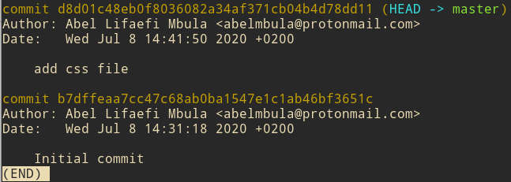

Git is a fantastic tool that every modern developer should know no matter the language they use. It tracks changes to your source code so that you don't loose any history of your project.

In this tutorial I want you learn the fundamental notions of Git and how you can host your code online on Github so that you can share your it with the word.

## Getting Started

Make sure you have already installed Git locally on your working desktop. If not, go [here](https://git-scm.com/downloads) to download it.

> **Tips**:<br>
> * To check if git is already installed, open the **Terminal** and hit:
> ```bash
> git --version # output git version 2.20.1
>```
> * To get the latest version of git: 
> ```bash
> git clone https://github.com/git/git
>```

To start working with Git, we need to create, if not already done, a directory (folder) for our project. On your Terminal window, type the command below:

 ```bash
mkdir my-project
```

Then we move to that project with `cd` command:

 ```bash
cd my-project
```

We can now tell git to track changes in this directory:

 ```bash
git init
```
The command above is so important as it helps create a git repository in your project.

> **Note**:<br>
> You can use Git in a **GUI** mode, but in this tutorial we are using **Shell** (**Terminal**) to type commands.
> You can use the built-in Terminal in your OS or the one that is integrated in your editor (VSCode for instance)

## Working Locally

The working flow of git is very simple:

1. Do some modifications
2. Add them to git
3. Create a commit (a snapshot) 

Let's detail them one by one.

**Do some modifications**

Adding or deleting content or files is what we call modifications. To check for (a) modification(s), hit

 ```bash
git status
```
If there's any modification, as in our case, you'll get this message:

 ```bash
On branch master

No commits yet

nothing to commit (create/copy files and use "git add" to track)
```

> **Note**:<br>
> If you try `git status` command in a project that is not recognized by git, you'll get this error:
>  ```bash
> fatal: not a git repository (or any parent up to mount point /)
> Stopping at filesystem boundary (GIT_DISCOVERY_ACROSS_FILESYSTEM not set).
> ```
> To fix it, just do `git init`.

**Add them to git**

Let's do some modifications in our project.

Create an `index.html` and add some content.  Use your favorite editor for that. If you want to use the command line:

 ```bash
touch index.html # create file
```

You can see if it was created with `ls` command.

To add content via CLI (Command Line interface)

```bash
echo "Hello World" > index.html 
```

Use `cat index.html` to see the content added.

Now we can see if git tracks our modification. On the terminal, type `git status`

```bash
On branch master

No commits yet

Untracked files:
  (use "git add <file>..." to include in what will be committed)

	index.html

nothing added to commit but untracked files present (use "git add" to track)
```

Git finds a file that is modified but not yet added for tracking. To do that you can use `git add <file>`. For simplicity I advice you to use:


```bash
git add .  # dot at the end
```

... to add any file that has been modified in our projet.

Doing `git status` once again, git will tell you that your changes are ready for commit.

Now is time to create our first commit.

**Create a commit**

Simply speaking, a **commit** is a version of your code at a given time; a snapshot of your code, if you want. You create it like this:

```bash
git commit -m "Initial commit"
```
> **Note**:<br>
> It is common to name your first commit as **Initial commit** or **First commit**. For the next commits, make sure you give a good description so that you can
> easily remember what change you did in that specific commit.


> **Tip**:<br>
> To edit the commit message of the current commit, use:
> `git commit --amend` command

> **Homework**:<br>
> Add more content in your project and create the second commit.

That's all for git workflow. You can repeat it as much as you want. Let's see some other useful commands.

## Other Git Commands

**History**

To get the history of your commits (different versions of your source code): 

```bash
git log
```

If you did the work above, you'll see at least 2 commits.



**Move back in the history**

The powerful of Git is that it allows you to easily go back in the history of your code. This is helpfull especial if the current code is broken and you want have it previous version. You need to have the commit id (aka SHA) to do this operation.

The commit id looks like this:

```bash
b7dffeaa7cc47c68ab0ba1547e1c1ab46bf3651c
```

To switch to any commit use

```bash
git checkout <sha>
```

You can use the whole commit id string or the first 7 charactors.

> **Tip**:<br>
> To move to the lastest commit use:
> ```bash
> git checkout master
> ```

## Host Your Source Code on GitHub

Github is an online plateform where developers host their source code. Go there and create an account if you don't have one.

## Conclusion

