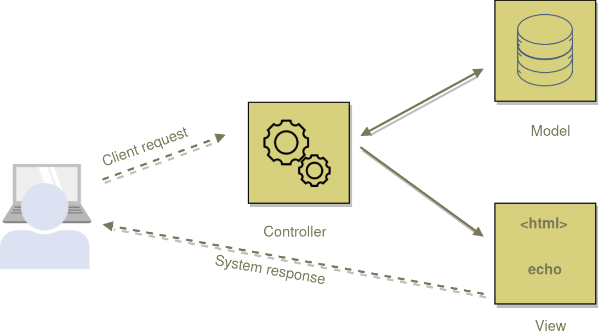

**MVC** stands for Model-View-Controller. It is an architectural pattern used to break up code into three logical components that serve very specific purposes: Models (data), Views (UI), and Controllers (application logic). 

The MVC pattern helps to achieve the principle of separation of concerns (a principle that asserts that software should be separated based on the kinds of work it performs).

The following diagram shows the three main components and which ones reference the others:



Let's dig deeper with each components.

## Model 
The model manages the data or business logic. It does not matter whether the data is from a database, API, or a JSON object; the model responsability is simply to manage it.

## View
The view or presentation logic is responsible for presenting content through the user interface based on the data in the Model.

## Controller
The controller is the brain in the MVC pattern. It handles the user request, process data, and load the appropriate view. As you can guess, it's the link between the view and model. In other words, the controller controls how the app responds to a given request. So, it's the initial entry point for your app.

Let's now see the MVC into action.

## MVC into action
For the sake of simplicity, let's build a basic app in PHP. The goal of this app is to print (display) the student info.

```
mkdir mvc-demo
cd mvc-demo
touch index.php student.php Student_model.php student_list_view.php
```
Nothing special here. We create all the necessary files we'll need. You can notice an additional file (`index.php`) that we'll do nothing than calling the controller (`student.php`):

```php
<?php
// index.php
// Let's call the controller
include "student.php";
```

Let's focus on the entry point.
**student.php**
```php
<?php
// Make the model available
include 'Student_model.php';

// Create an instance
$studentModel = new Student_model();
// Get the list of student
$studentList = $studentModel ->getAllStudents();

// Show the view
include 'student_list.php';
```
As we said earlier, the controller is the link between the view and model.

**Student_model.php**

```php
<?php
class Student_model 
{
  // Because we don't have a db, let's hard code data
   private $data = array(
      "abel" => array(
         "fullName" => "Abel Mbula" ,
         "point" => 90,
         "grade" => "A"
       ),
       "pati" => array(
         "fullName" => "Patience Kavira" ,
         "point" => 80,
         "grade" => "B"
       ),
       "salimas" => array(
         "fullName" => "Sarah Lifaefi" ,
         "point" => 95,
         "grade" => "A"
       )
   )

   function getAllStudent() {
        return $data;
    }
}
```

Since what we're doing is simple, we only have one method (`getAllStudent`), but you can add as many as you want.

**student_list_view.php**

```php

<?php foreach ($studentList as $key => $student): ?>

      - Name: <?= $student['fullName']; ?>, 
        Point: <?= $student["point"]; ?>,
        Grade: <?= $student["grade"]; ?><br>
 
<?php endforeach; ?>
```
That is it for our demo. I think it makes sense how to practice MVC.

## Conclusion
The MVC pattern helps to achieve the principle of separation of concerns. All requests are routed to a Controller that is responsible for working with the Model to perform actions and/or retrieve data. Afterward the Controller chooses the View to display and provides it with the Model. Last but not least the View renders the final page, based on the received data.