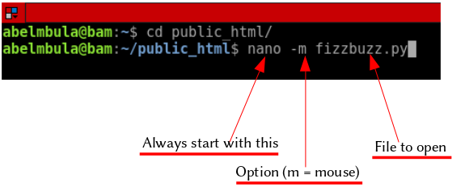

Nano is an easy to use and friendly command line text editor for UNIX-like systems. It can be customized with command line options or with the `.nanorc` file.

## Improve the usability of Nano with command line options

This is the simplest way to configure Nano. You just need to add option(s) when calling Nano on your terminal as this:

As you can see on the image above, we will be opening the fizzbuzz.py file with the mouse support enabled on the command line. It means that mouse clicks can be used to place the cursor, set the mark (with a double click), and execute shortcuts. By default the mouse is not supported on the console.
Note that if mouse support is not available on your system, e.g.: you have installed a fully command line system, this option can’t work for you.

Option | Description
--- | --- 
-m (--mouse) | Enable mouse support
-i (--autoindent) | Indent new line's to the previous indetention. Useful when editing source code
-l (--linenumber) | Display line numbers to the left of the text area 

Note: You can learn about more option by typing `man nano` on your `terminal`.

### Pros and cons

The method we just learned helps you quickly configure `Nano` but your configuration is not persistent (saved). You have to do it every time you want to use it. For that reason there is an other way to configure the text editor once for all that we discuss in line below.

## Configure Nano with .nanorc

`Nanorc` is the file configuration for Nano. Let's create one in our home directory. On your terminal make sure your on your home (run `$pwd`). If not at home do `cd ~`.

Run `nano .nanorc` (don’t forget the dot (.)). When the file opens, type these options (see below).

Save the file by doing `Ctrl + X` and hint `Y` (for `yes`).

The great advantage with this method is that your configuration is kept and you don’t need to set every time you use nano commands.

Note: You can learn about more options by typing `man nanorc` on your terminal.

### Global nanorc

If you want to configure Nano for all users in your system you have to use the global `nanorc` file. To do so, open the` /etc/nanorc` (without the dot(.)) with nano command and uncomment (delete `#` before an option) what you want. You need `root` or `sudo` privilege.

I have deleted the # before set autoindent option.

