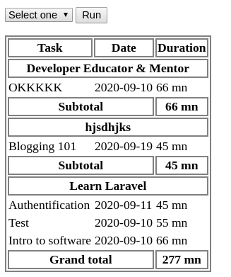
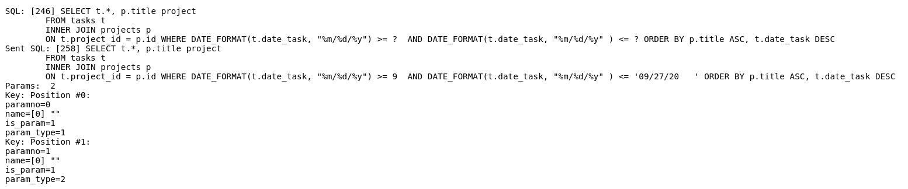

A new day, a new tutorial.

As you know, I'm bussy nowadays working on a course for **Educative Inc**. While working on the course project, I encountered an issue with my database. After successfully debugging it, I found that it was important for me to share with you my solution hoping it will be for help one day.

First, let's see what was the:

# Problem

I was implementing a feature to filter by **date**, but this was not working as expected and I could not figure out why. Let's reproduce it.

First, [create a database](pdo-php) and call it `tracker` or whatever you want. Import this [.sql file]() in your database. You now have a database with tables and content.

> **Note**: I strongly encourage you to edit the .sql file before importing by modifying date field: add the more recent dates, like last week or month dates and this week or month dates.

Now if you try to filter for this week, you get the exact same result for last week filter. Today is **Sept 28, 2020**. Given that:

- last week goes from **Sept 21, 2020** to **Sept 27, 2020** and
- this week **Sept 28, 2020** - **Oct 04, 2020**.

Last week selection

This week selection

Do you notice the difference between the two selections? I think no. So, why are they equal?

# Let's debug

If you're like me, before I find a good approch to debug this issue, you'll go through every file and line in your source code. But I can guarante you, you won't find the solution so quickly :). But you can try if you want.

I've written this article so that you spend less time debugging your PHP & MySQL apps.

Now you can go open the source code. In the `get_all_tasks()` function, just after `$tasks->execute()` add this:

```
$tasks->debugDumpParams($tasks);
```

Let's try to filter again.

**Last week**



You can notice that `debugDumpParams()` shows us our sql query and the one that was really executed (**Sent SQL**). From there we can notice that our first date is beeing converted to an **integer** and the last date has **empty string** at the end.

**This week**

If you filter for **this week** you'll almost get the same `debugDumpParams()` output.

So, now we know where the bug is. Let's

# Fix the bug

If the first date is beeing converting to an integer is because of this

```
$tasks->bindValue(1, $filter[1], PDO::PARAM_INT);
```

Change `PDO::PARAM_INT` to `PDO::PARAM_STR`.

The last thing to do is to use `trim()` to avoid empty string: `trim($filter[1])` and `trim($filter[2])`

Now if you try to filter by last or this week, you won't have any result as there's no data matching this creteria.

Congratulations, you're now an expert at debugging, an important skill for any developer.

# Closing thought

In this tutorial we learned how to use `debugDumpParams()` to quickly debug our PHP & (My)SQL app. I thing that you enjoyed the tutorial. Share with me other tips for debugging.

You can find the source code here.
