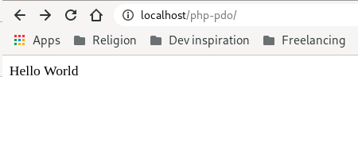
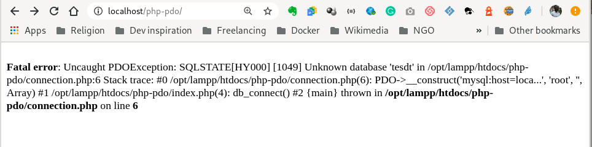

A new day, a new tutorial.

As you know, I'm bussy nowadays working on a course for **Educative Inc**. While working on the course project, I encountered an issue that I want to share with you my solution hoping it will be for help one day.

First, let's see what was the:

# Problem

I was implementing a feature to filter by date, but this was not working as expected and I could not figure out why. Let's reproduce it.

# Prerequisite

---

- Be familiar with the PHP language
- Have a local PHP and MySQL/MariaDB environment
- [Optional] Have a GUI database management app (`phpmyAdmin` or others), if you don't have/need this you can use CLI to connect to the database

# Goal

---

I've seen a lot of tutorials still teaching deprecated technics to connect to MySQL database in PHP. So, I want this to stop. My goal in this tutorial is to teach you a modern and secure way to connect to any SQL database in PHP. You'll learn how to use PDO method.

In this tutorial, I'll be working with MySQL database. There's no much difference with other SQL-like database systems. So, feel free to use anyone you have.

Let's start our tour.

# The workspace

Create a folder for the project (mine is `php-pdo`)

```sh
mkdir php-pdo
```

Add `index.php`, `config.php` and `connection.php`

```sh
touch index.php config.php connect.php
```

Create also a database (`test`).

```sh
CREATE DATABASE IF NOT EXISTS test;
```

# Connecting to the database with PDO

To connect to a database, you can use either database-specific extension like [MysQLi](https://www.php.net/manual/en/mysqli.overview.php) for MySQL or the [PHP Data Objects](https://www.php.net/manual/en/book.pdo.php) (aka PDO). The advantage of using PDO is that it can be used to connect to any database. For that reason, we will use PDO in this tutorial.


Now is the time to start using PDO. In `connection.php`, create an instance of PDO like this:

```php
<?php
$connection = new PDO();
```

> **Note**: <br>
> If you're not familiar with **object-oriented programming**, it's possible that the way we work with or use PDO might look a bit strange for you. But don't worry, I'll try as much as I can to explain the important things you need to efficiently implement PDO

PDO() accepts these four parameters:

- **DSN (data source name)**: type of database, hostname, database name (optional)
- host login
- host password
- additional options

Considering our database info, let's replace these parametors with their real values:

```php
<?php
$connection = new PDO("mysql:host=localhost;dbname=test", "root", "", [
  PDO::ATTR_ERRMODE => PDO::ERRMODE_EXCEPTION
  ];
```

> **Notes**<br>
>
> - The line `PDO::ATTR_ERRMODE => PDO::ERRMODE_EXCEPTION` instructs PDO to emit an [exception](https://www.php.net/manual/en/class.pdoexception.php) in case of an error.
> - You may have noticed that I'm not closing my PHP tag. It is optional and even better to leave it off if the last thing you have in a file is PHP code

We are professionals, let's code as professionals.

# Refact the code

Our connection works just fine, but we can still refactor the code. Let's simplify our connection string like so:

```php
$connection = new PDO($dsn, $username, $password, $options);
```

In `config.php`, we put all database info:

```php
$host       = "localhost";
$username   = "root";
$password   = "";
$dbname     = "test";
$dsn        = "mysql:host=$host;dbname=$dbname";
$options    = [
    PDO::ATTR_ERRMODE => PDO::ERRMODE_EXCEPTION
];
```

> **Note**:<br>
> If you use a database other then **MySQL**, you just need to change `mysql` in `$dsn = "mysql:host=$host;dbname=$dbname"` with the name of your database like `pgsql`.

Now we can call `config.php` in `connection.php`.

```php
<?php
function db_connect()
{
  require "config.php";
  $connection = new PDO($dsn, $username, $password, $options);
  return $connection;
}
```

We create a function that returns the database connection object. Now is the time to:

# Use the connection string

In `index.php` we can use the `db_connect()` function like this:

```php
<?php
require "connection.php";

$connection = db_connect();

?>

<p>Hello World</p>
```

Going to the browser, you'll have `Hello World` printed if everything is OK.



> But what happens in case of an error?

Good question. Let's see how to:

# Handle exceptions

Simply speaking, exceptions are just errors. Remember that we've set PHP attributes to emit errors as exceptions (`PDO::ATTR_ERRMODE => PDO::ERRMODE_EXCEPTION`).

First, go to `config.php` and put something wrong. Let's say I put the database password as **blablabla**. Now on the browser, you have this:



As you can see in the image above, the application has encountered an error. It gives the description of the error and also the line where the problem can be found. This can be interesting if we are still developing our app, but when in production, it is a high-security risk. We don't want to reveal to our visitors too much information about the error. You can notice that the application error tells much about our code: the file, the connection string, and the line.

To fix this issue, we need to use `try/catch` block.

```php
try {
        require "config.php";
        $connection = new PDO($dsn, $username, $password, $options);

        return $connection;
    } catch (PDOException $e) {
        die($e->getMessage());
    }
```

In a nutshell, the snippet above will first try to connect to the database, and if it encounters an error it catches it and prints just an explicit error message.


# Conclusion

---

In this tutorial we've learned how to write a script to connect to an SQL database in PHP like a pro:

- Use PDO
- Use `try/catch` block to handle errors.

You can find all the code [here](https://github.com/Bam92/php-pdo).

Thank you for learning with me.
