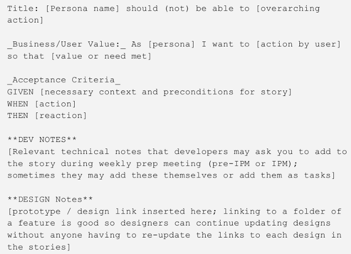

Pivotal Tracker, simply called Tracker, is a tool that helps software development teams predict when work might be completed and allows them to work consistently.

In this tutorial, you'll learn how to get started with Pivotal Tracker as well as its workflow. Let's go!

# Getting started

- Sign up [here](https://www.pivotaltracker.com/signup/new?source=navbar) (if you don’t yet have an account on Tracker)
- Click “Create Project” on the Dashboard and enter a name to create an empty project

You may notice that Tracker focuses your team in collaboration on a backlog of stories. These are short but concrete descriptions of functionalities view from a user perspective. Stories are prioritized and listed in the backlog.

# The Workflow

Now that you have access to the dashboard, we can see the workflow in Tracker. It is simple, you start by:

## Writing stories,

On your project Dashboard in the Icelog panel, click add story button:

- give a title to your story
- select a type (_feature_ is the default one)
- add a description using the format as shown in the image below (or the one you have in your team)
- save your story and you’re done. Iterate the same thing until you’re done with all features of your project

Tracker has many story types, here are the most important to know:

- **feature**: for functionality that provides a verifiable business to customer
- **chore**: provides no direct, obvious value to the customer (e.g.: configure Travis-CI)
- **bug**: for unintended behavior that can be related to features

The next step is:

## Prioritizing and estimating

On Pivotal Tracker stories are estimated as:

- **easy** = 1 point
- **medium** = 2 points
- **hard** = 4 points

After estimating stories, the product owner can move stories from icelog to the backlog in terms of importance.

We can now:

## Deliver the story

By clicking the finish button so that the product manager can check.

## Story acceptance

Once you’ve pressed the “deliver” button, the product manager now tries the feature to confirm if it works as expected. If everything checks out he can accept the story. The story will now move to _Done panel_.
If the story does not work well, the product manager reject it by explaining why. You have to restart it.

# Wrap up

To wrap up we have learned in this post how to efficiently use Pivotal Tracker for project management. The core concept of Tracker is user stories. We saw how we write, prioritize and deliver them; and how they get accepted. I hope that you will be doing well in your software project with this tool.
