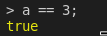

We often need to compare values when we are programming. To check for equality in JavaScript, there are more than one way of doing it. You can use either a double equals operator, ==, aka "soft equality" or the triple equals operator, ===, aka "hard equality".

Let's see them in more detail.

## The Soft Equality

It only checks for equality in value, not in type.

For example if we assign the number 3 to a variable like this: `const a = 3;`

and compare it like so:


This works fine, but there are some slight problems with double equals operator. Let's test again with the string "3":


As you can see here, the returned output is `true` when in reality it should be `false` because `a` is not a `string` but a `number`. So what happened so that we get `true`? When soft equality is used, JavaScript will attempt
to coerce the two values to the same type when doing the comparison. This "bad behavior" of JavaScript can lead to some very strange results. Let's see some more examples:

```js
" " == 0;
<< true

" " == "0";
<< false

false == "0";
<< true

"1" == true;
<< true

"2" == true;
<< false

"true" == true;
<< false

null == undefined;
<< true
```

The snippet above shows that values that are not actually equal have a tendency to be reported
as being equal to each other.

## The Hard Equality

Unlike the soft equality, this equality operator checks for both the **value** and the **type**. It is also called a stricter equality test and returns **true** only if the two elements are the same.

Let's use the same example as above with hard equality and see how it will behave.

```js
a === 3;
<< true

a === "3";
<< false

null === undefined
<< false
```

As you can see, `a` is equal to number 3, but not equal to the string 3. The hard equality operator also correctly reports that `null` and `undefined` are two different values.

I have written a tutorial about `null` vs `undefined` that you can check here

## Which one to use?

This is a good question, and the simple and quick answer is **it depends** upon your need. If your program does not need to check for the value type before doing operations (i.e you're certain that both sides will still have the same type), you can go for soft equality. In the other case and by default, I would suggest to always go for hard equality. Some bugs in program are due to the use of soft equality and it is often difficult to discover them.
