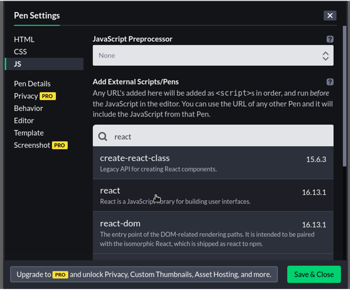

CodePen is a social environment for developers You can quickly test and share any front-end related creation.

React is a front end library, so, it can be used on CodePen. Let's see how.

## Prerequisite

You should be familar with [CodePen](https://codepen.io/pen/). At least, you know how to create a pen.

## Step by step Process

In this guide, we're going to create a simple `Hello World!` program using React on CodePen.

First thing first, create a new pen on CodePen. Once done, go to the **Settings** (see top right of the page).

In the dilogue box that appears (**Pen Settings**), click **JS**.

In the search bar, type **react**. In the result click **react** to add it. Repeat the same action to add **react-dom**. After adding all packages you need, click **Save & Close** button.



You now have React ready to be used in your pen. But we need to fix one more thing to be completly ready to start working.

If you're going to use [**JSX** syntax](blog/jsx-syntax-how-to), you must add **Babel**.

Return where we were and on **JavaScript Preprocessor**, click the box to select **Babel**. Don't forget to save your new change.

You're now ready to build React based apps on CodePen. To make sure everything is OK, let's add the code below in our editor.

**HTML box**:<br> `<div id="root"></div>`

**JS box**: <br>

```js
const rootElt = document.getElementById("root")
const childElt = <div className="container">Hello world</div>
ReactDOM.render(childElt, rootElt)
```
If something is broken in your pen, go and fork mine.

https://codepen.io/bam92/pen/MWYGYyE


## Closing Notes
To start using **React** on CodePen, you need to add **react** and **react-dom** packages and **Babel** to the settings of your pen.

Happy coding!
