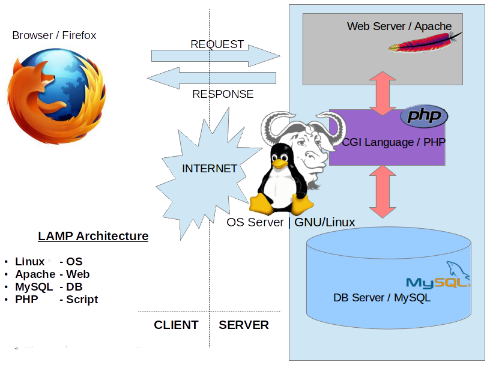

Who said that everything in GNU/Linux should be a headache for the users/developers? Did you know that you can have a ready to use software bundle to set up an LAMP environment? Read the tutorial below to learn how to do so.

The purpose of this tutorial is to show you a step by step guide on how to get started with XAMPP in your GNU/Linux OS.

> **Note**: I'm using Debian GNU/Linux, but I thing the process is almost the same with other distros.

# LAMP in a nutshell

First thing first, _what's LAMP_?.

L.A.M.P is an acronym for **L**inux, the OS layer; **A**pache, the webserver layer; **M**ySQL (MariaDB), the DB layer and **P**HP (Python), the scripting layer. It's a suitable solution for building dynamic websites and web apps.

> **Note**: Although it was originated from the GNU/Linux world, the “LAMP” or better the “AMP” acronym now refers to a generic stack model. So, it's called **WAMP** in Windows and **MAMP** in Mac.



# Installation

XAMPP is a cross-platform LAMP stack solution meaning that you can use it on all OSs.

Download the Linux installer [here](https://www.apachefriends.org/index.html).

Make it an executable like so:

- right-click on the file and go to `Properties`
- under `Permissions` tab, mark `Allow executing file as program` (see image)


Or via command line (CLI)

```
chmod 755 xampp-linux-*-installer.run
```

Next, you could just double-click the installer to start the installation process. unfortunately, XAMPP requires **root privilege**


Let's see how to fix it.

Move to the directory where you have downloaded the installer, right-click to open the `Terminal` window. From the CLI, run this command:

```sh
sudo ./xampp-linux-*-installer.run
```

You'll be prompted for your password. Type it and hit the **Enter** button to launch the **Wizard**. You should be able to install XAMPP following the Wizard.

Congratulations. You've successfully installed XAMPP in your system. Let's see how to start/stop it.

# Turn the server on/off

Now that you've configured a sever in your local machine, you may need to start or stop from time to time. Let's see how to do so.

The XAMPP you've just installed is a CLI programm, so you'll need the Terminal in order to use it.

**Turn the server on**

You simply need to type the command below from the Terminal

```
sudo /opt/lampp/lampp start
```

**Turn the server off**

```
sudo /opt/lampp/lampp stop
```

> **Be aware**:
> If you have `Apache` locally installed, you may first need to stop it before starting XAMPP `sudo service apache2 stop`.

If you find that typing `/opt/lampp/` is too long, you can add it in your environment variable.

That's all for today.

# Closing thoughts

In this tutorial we've learned what's a LAMP environment, how to install it and how to start and stop the server. I hope that you've find the tutorial useful.

Thank you for reading. Hope to see you in a next tutorial. You should contact me on [Twitter](https://twitter.com/abelmbula) for any suggestions or questions.
